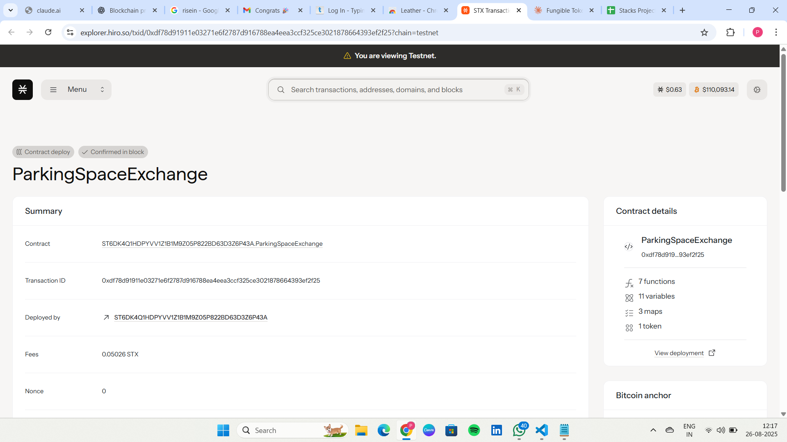

# Parking Space Exchange

## Project Description

The Parking Space Exchange is a decentralized peer-to-peer parking space rental platform built on the Stacks blockchain using Clarity smart contracts. This innovative solution addresses urban parking challenges by enabling property owners to monetize their unused parking spaces while providing drivers with convenient, real-time parking options.

The platform features dynamic pricing mechanisms, real-time availability tracking, and secure blockchain-based transactions. Space owners can list their parking spots with custom hourly rates, while renters can easily discover and book available spaces with transparent pricing and automated payments.

## Project Vision

Our vision is to revolutionize urban mobility by creating a decentralized, efficient, and transparent parking ecosystem. We aim to:

- **Reduce Urban Congestion**: By maximizing the utilization of existing parking infrastructure, we help reduce the time drivers spend searching for parking, ultimately decreasing traffic congestion and emissions.

- **Democratize Parking Revenue**: Enable property owners, from homeowners to businesses, to generate passive income from their underutilized parking spaces.

- **Enhance Urban Accessibility**: Provide drivers with predictable, pre-bookable parking options, making city navigation more convenient and stress-free.

- **Foster Sustainable Cities**: Support smart city initiatives by optimizing resource utilization and reducing the environmental impact of urban transportation.

- **Build Trust Through Transparency**: Leverage blockchain technology to ensure transparent pricing, secure transactions, and immutable booking records.

## Future Scope

The Parking Space Exchange platform has extensive potential for growth and enhancement:

### Phase 2 Enhancements
- **Advanced Rating System**: Implement comprehensive rating and review mechanisms for both space owners and renters
- **Dynamic Pricing Algorithms**: Introduce AI-powered pricing that adjusts based on demand, location, time of day, and events
- **Space Verification**: Integration with IoT sensors for real-time occupancy verification and automated check-in/check-out

### Phase 3 Expansions
- **Multi-Chain Integration**: Expand to other blockchain networks to increase accessibility and reduce transaction costs
- **Mobile Application**: Develop user-friendly mobile apps with GPS integration, navigation assistance, and push notifications
- **Corporate Partnerships**: Establish partnerships with businesses, event venues, and municipalities for bulk space management

### Phase 4 Advanced Features
- **Predictive Analytics**: Machine learning models to predict parking demand and optimize space allocation
- **Integration with Ride-Sharing**: Connect with ride-sharing and delivery services for commercial parking solutions
- **Carbon Credit System**: Reward users for reducing emissions through efficient parking utilization
- **Subscription Models**: Offer monthly/annual parking subscriptions for frequent users

### Phase 5 Ecosystem Development
- **Parking Space Marketplace**: Enable trading of parking space NFTs as digital assets
- **Insurance Integration**: Provide automated insurance coverage for both vehicles and property
- **Government Integration**: Work with city planning departments for integrated smart parking solutions
- **International Expansion**: Scale the platform globally with localized features and compliance

### Technical Roadmap
- **Layer 2 Scaling**: Implement layer 2 solutions for faster and cheaper transactions
- **Interoperability**: Cross-chain functionality for broader blockchain ecosystem integration
- **Advanced Smart Contracts**: More sophisticated contract features including escrow services and dispute resolution
- **Data Analytics Platform**: Comprehensive dashboard for space owners and platform analytics

## Contract Address Details
contract id:ST6DK4Q1HDPYVV1Z1B1M9Z05P822BD63D3Z6P43A.ParkingSpaceExchange

### Mainnet
- **Contract Address**: `[To be added]`
- **Contract Name**: `[To be added]`
- **Deployment Transaction**: `[To be added]`

### Testnet
- **Contract Address**: `[To be added]`
- **Contract Name**: `[To be added]`
- **Deployment Transaction**: `[To be added]`

### Contract Functions

#### Core Functions
1. **list-parking-space**: Allows users to list their parking spaces for rent
2. **book-parking-space**: Enables renters to book available parking spaces

#### Read-Only Functions
- **get-parking-space**: Retrieve details of a specific parking space
- **get-booking**: Get booking information by booking ID
- **get-owner-earnings**: Check total earnings for a space owner
- **get-next-space-id**: Get the next available space ID
- **get-platform-fee**: Current platform fee percentage

### Getting Started

1. Deploy the contract to Stacks blockchain
2. Initialize the contract with desired parameters
3. Start listing parking spaces using `list-parking-space`
4. Book available spaces using `book-parking-space`

### Platform Economics

- **Platform Fee**: 5% of each booking transaction
- **Payment Method**: STX tokens
- **NFT Representation**: Each parking space is represented as an NFT for ownership verification
- **Automated Payments**: Smart contracts handle all payment distributions automatically

---

*For technical support, integration assistance, or partnership inquiries, please refer to the project documentation or contact the development team.*